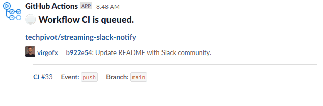
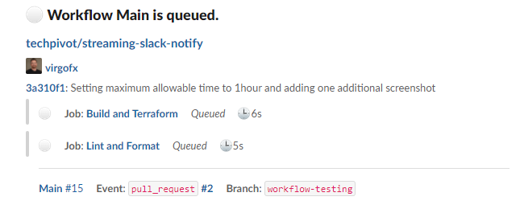
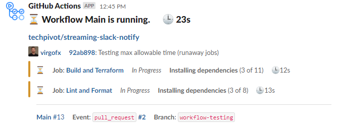
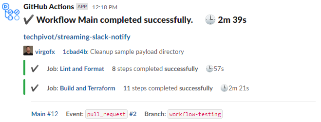
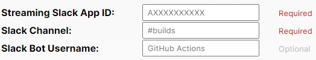

  

<h1 align="center">Streaming Slack Notify</h1>

<h4 align="center">
  The definitive service for streaming GitHub action workflow jobs to Slack.
</h4>
<h6 align="center">
  Actively maintained by <a href="https://www.techpivot.net">TechPivot</a> and the community.
</h4>

  
  
  
  

## Live Slack Workflow

## Screenshots

| Workflow Queued                                                                                   | Workflow Running                                                                                  | Workflow Complete                                                                                     |
| ------------------------------------------------------------------------------------------------- | ------------------------------------------------------------------------------------------------- | ----------------------------------------------------------------------------------------------------- |
|  |  |  |

## Motivation

The existing GitHub actions that post to Slack were only displayed at the conclusion of workflow runs, which results in
ambiguous job status for long-running workflows. Additionally, existing actions contained limited information and often
prioritized the wrong data elements. This service attempts to solve those issues by registering the Streaming Slack
Notify GitHub and Slack applications, linking them together, and polling workflow runs via a lightweight cloud-native
and cost-optimized service.

## Features

- Fully open sourced including entire AWS infrastructure, API endpoints, and server poller
- Ability to display job step status from beginning of workflow to end
- Single slack message that continuously updates the current job statuses
- Support for **push**, **pull_request**, **schedule** events
- Clean and consistent Slack UI
- Lightweight, minimal dependencies, and pure TypeScript
- Lean AWS cloud footprint that utilizes free tier services and cost-optimized services

## Installation

> **Note**: You must register your Slack workspace first prior to installing this application as your Slack app ID token
> is required in the GitHub App Post-Install Configuration.

### 1. [Slack App](https://slack.com/oauth/v2/authorize?client_id=3012618307.1089892585986&scope=chat:write,chat:write.customize,chat:write.public&user_scope=)

1. First, install the Streaming Slack Notify application in your Slack workspace using the **Add to Slack** button.
   

1. Copy the **Streaming Slack App ID** displayed in the green box _(Required in GitHub Post-Install Configuration)_

### 2. [GitHub App](https://github.com/apps/streaming-slack-notify)

1. Navigate to the [Streaming Slack Notify GitHub application](https://github.com/apps/streaming-slack-notify)
1. Click **Install** in the upper right corner
1. Select the organization or user account to install the app
1. Select which repositories you want to configure streaming Slack notifications for - Either all or a defined list
1. Click **Install**

#### Post-Install Configuration

1. On the GitHub post-install configuration page, paste the token generated in the Slack app registration into the
   **Streaming Slack App ID**

   

1. Specify the **Slack Channel** for which live workflow notifiations should be displayed
1. Optionally, you can override the default Slack Bot Username that posts the messages in the channel. _(Default =
   GitHub Actions)_
1. Click **Update** to save and link your settings

## Cost Optimization

The current infrastructure is deployed in a dedicated AWS account that is actively managed by TechPivot. In order to
provide a public service such as this, various parts of the infrastrucure are cost-optimized including:

- EC2 Spot Instances - Reducing cost by running on small instances that can be interrupted and easily resumed by other
  instances from a large pool.
- Minimizing the number of EC2 Metrics - Metrics are free for the first 10 and \$0.30/month thereafter.
- Graviton instances with corresponding reduced sized EBS root volume to account for the $0.10/GB cost and default 30GB
  EBS ECS images.
- Leveraging AWS free tier services including DynamoDB, Lambda, and API Gateway.

## Support

We greatly appreciate donations to help fund our AWS infrastructure costs. Additionally, we ♥ GitHub stargazers and
members in our Slack community.

- [Star our GitHub Project](https://github.com/techpivot/streaming-slack-notify/stargazers) :star:
- [Donate](https://github.com/sponsors/techpivot)
- [TechPivot Slack Community](https://join.slack.com/t/techpivot/shared_invite/zt-qu89fikk-lagR4dXfwqODi7tbc8~cRg)

## License

[MIT](./LICENSE) © 2021 TechPivot

---

> **[TechPivot](https://www.techpivot.net)**&nbsp;&nbsp;&middot;&nbsp;&nbsp;GitHub
> [@techpivot](https://github.com/techpivot)&nbsp;&nbsp;&middot;&nbsp;&nbsp;LinkedIn
> [techpivot](https://www.linkedin.com/company/techpivot/)&nbsp;&nbsp;&middot;&nbsp;&nbsp;Twitter
> [@techpivot](https://twitter.com/techpivot)
